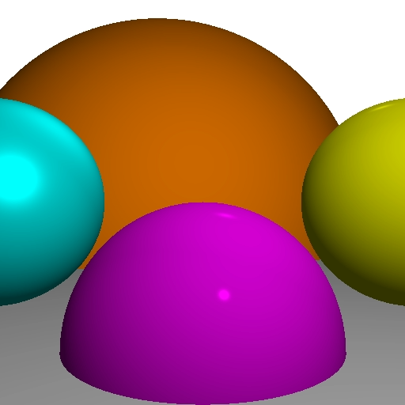
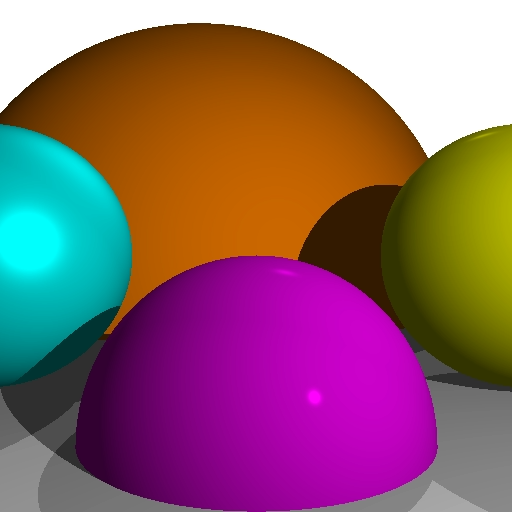
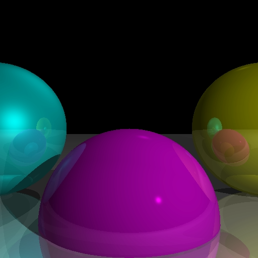

Raytracing playground based on [Computer graphics from scratch](https://gabrielgambetta.com/computer-graphics-from-scratch/).

# Basic Raytracing

# Diffuse reflection

# Specular reflection

# Shadows

# Reflections

